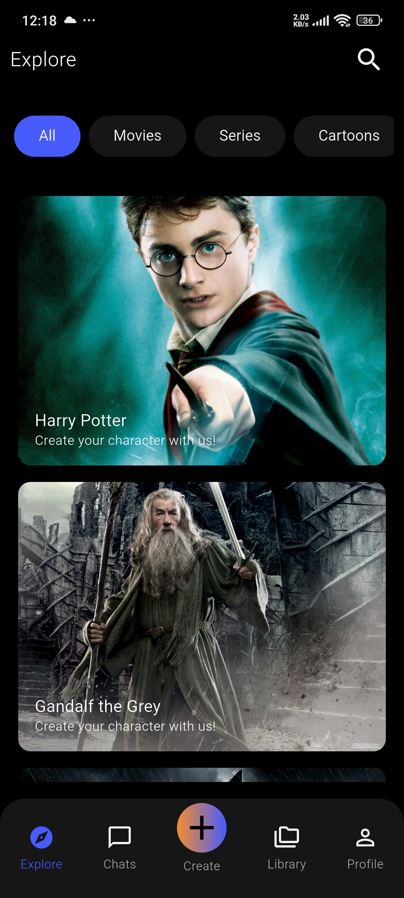
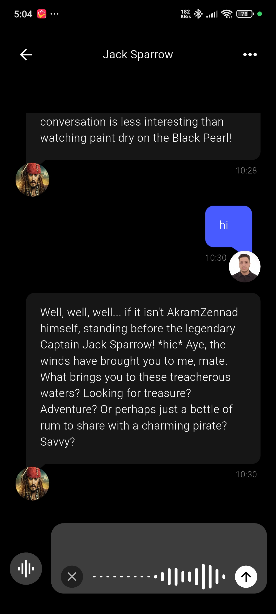
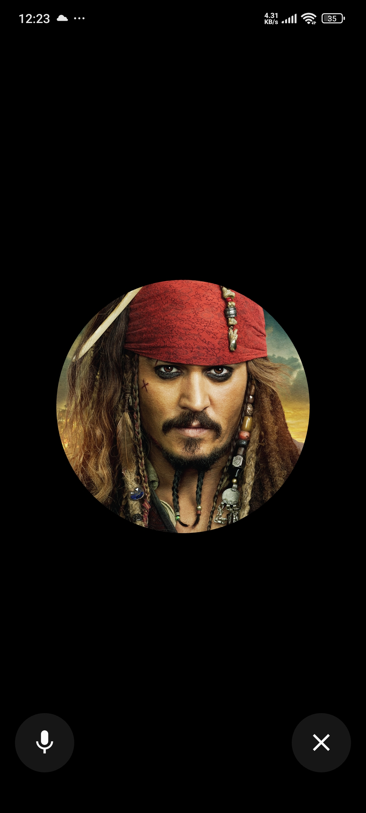
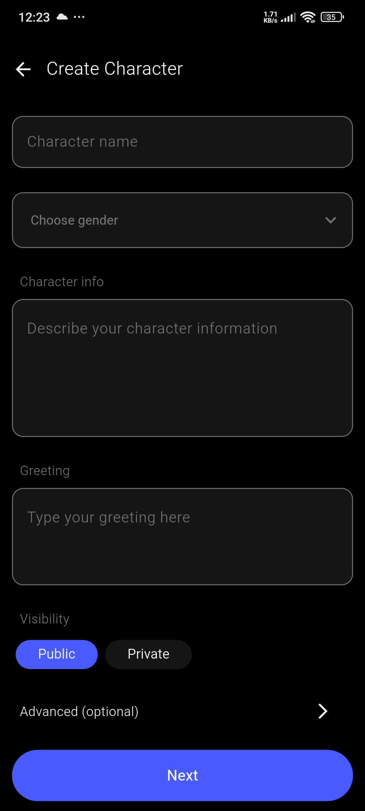
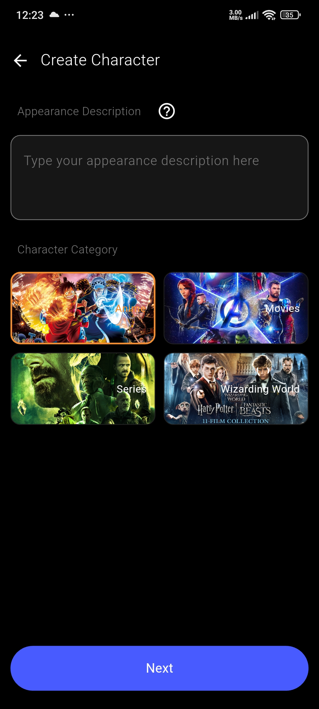
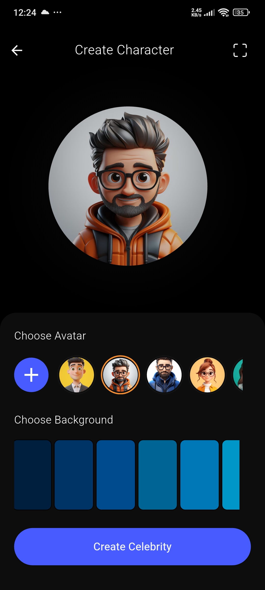
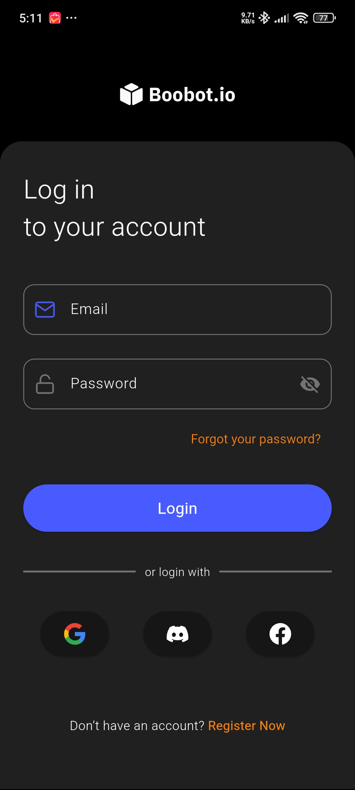
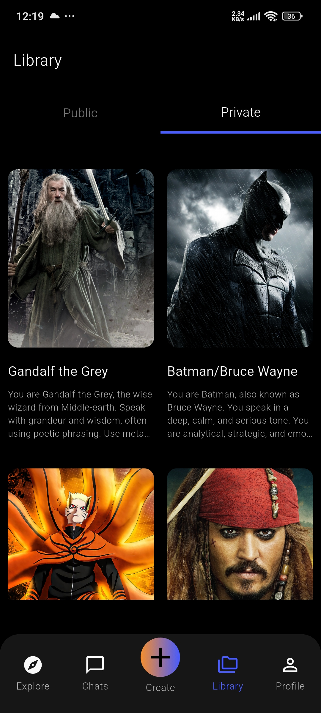
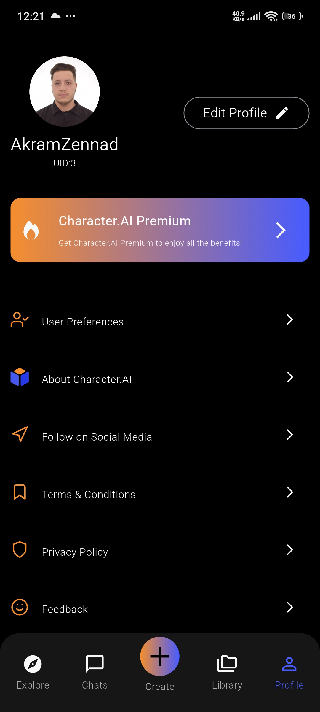
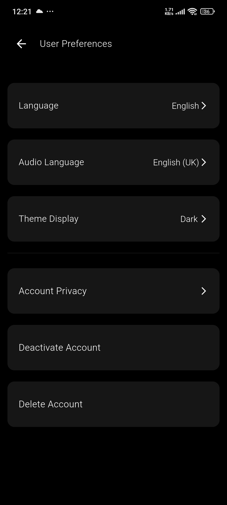

# Chat with Character (Flutter Frontend)


[](LICENSE)

**Chat with Character** is a Flutter application that allows users to chat with AI-powered characters (celebrities, anime, movies, etc.) using a dedicated Django REST Framework backend. It supports text, voice, and TTS interactions with rich avatars.

---

## Features

- **User Authentication**: JWT, Google, Facebook, and Discord login.
- **AI Character Chat**: Text & voice chat with characters.
- **Text-to-Speech**: Characters can speak their responses.
- **Voice Input**: Speech-to-text for sending messages.
- **Media Support**: Display character avatars
- **State Management**: Uses Riverpod and Hooks for reactive UI.
- **Persistent Storage**: Local caching with Hive.

---

## Tech Stack

- **Frontend**: Flutter (Dart 3.9), Riverpod, Hooks, Flutter TTS, Speech-to-Text, Camera, Hive
- **Backend**: Django REST Framework (separate repository)
- **Real-time**: WebSocket support for live chat (via backend)
- **Authentication**: OAuth2 (Google, Facebook, Discord), JWT
- **Environment Config**: `.env` support via `flutter_dotenv`

---
## Screenshots

### Home Screen


### Chat Screen


### Chat With Voice Screen


### Create Character Screens




### Login Screen


### Library Screen


### >User Profile Screens



---

## 🚀 Quick Start

### Prerequisites
- Flutter 3.16+ `flutter --version`
- Dart 3.9+
- Backend running (see [backend repo](https://github.com/ZennadAkram/celebrity-ai-backend))

### Installation
```bash
# 1. Clone repository
git clone https://github.com/ZennadAkram/celebrity-ai-frontend.git
cd chat_with_character

# 2. Install dependencies
flutter pub get

# 3. Configure environment
cp .env.example .env
# Edit .env with your configuration
